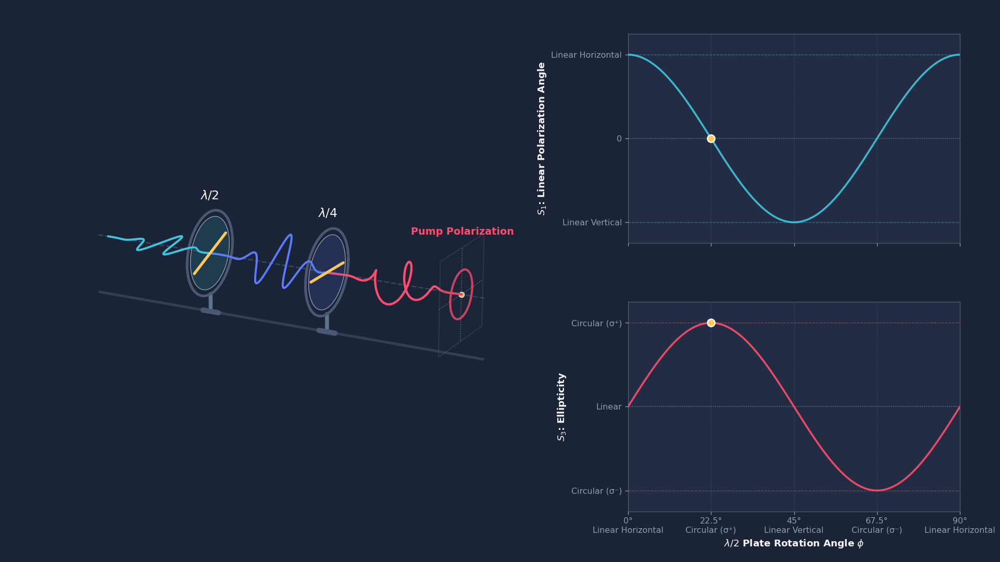

# PolarizationSimulation

3D visualization and Stokes parameter analysis of laser polarization modulation across a rotatable half-wave plate ($\lambda/2$) and quarter-wave plate ($\lambda/4$).



## Overview

- **3D Optical Rail**: Renders schematic optical mounts ($\lambda/2$ and $\lambda/4$) and laser pulse packets propagating along the beamline.
  - Before $\lambda/2$: Horizontally polarized linear laser pulse.
  - Between $\lambda/2$ and $\lambda/4$: Rotated linear pulse (by angle $2\phi$).
  - After $\lambda/4$: Left-/Right-circularly polarized corkscrew helix ($\sigma^+ / \sigma^-$) or linear states.
  - Output Screen: Real-time projection ellipse and instantaneous electric field tip.
- **Synchronized 2D Stokes Evolution**:
  - $S_1$: Linear polarization angle parameter ($\cos 4\phi$).
  - $S_3$: Ellipticity parameter ($\sin 4\phi$).
  - Gold tracking markers synchronized with the rotating waveplate.

## Usage

```bash
# Run interactive live animation
python polarimetry_simulation.py

# Export high-resolution MP4 video (1080p, 10 seconds duration, slow pulse propagation)
python polarimetry_simulation.py --output polarimetry_simulation.mp4 --fps 30 --duration 10.0 --speed 1.10

# Export animated GIF
python polarimetry_simulation.py --output polarimetry_simulation.gif --fps 20 --duration 10.0

# Generate a static preview frame
python polarimetry_simulation.py --preview
```

## Generated Artifacts

- `polarimetry_simulation.mp4`: 1080p H.264 video.
- `polarimetry_simulation.gif`: High-quality 1280x720 animated GIF (infinite loop).
- `polarimetry_preview.png`: High-resolution preview image.
